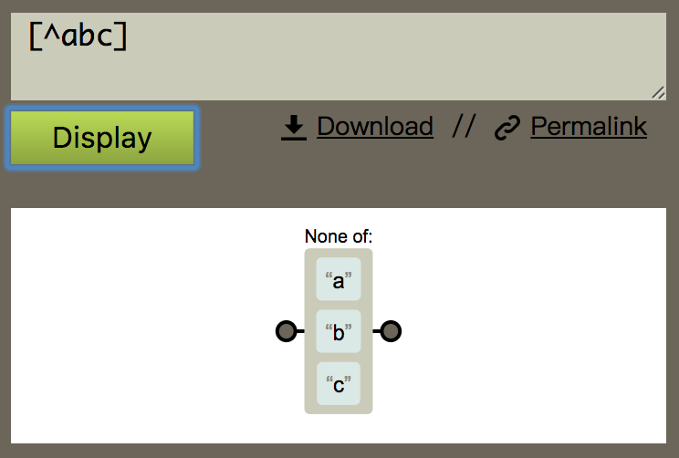

# JavaScript正则表达式

> 笔记整理自慕课网视频 [正则表达式简介及工具使用](http://www.imooc.com/video/12539)

> 一个在线正则解释工具：https://regexper.com/

## 目标：
1. 了解正则表达式语法
2. 在IDE中使用正则表达式处理规则复杂的字符串查找、替换等工作
3. 在JavaScript程序设计中使用正则表达式处理字符串

## 什么是正则表达式？
* **Regular Expression** 使用单个字符串来描述、匹配一系列 **符合某个语法规则** 的字符串
* 简单来说就是 **按照某种规则去匹配符合条件的字符串**

#### 通配符： *

* 在终端中输入以下命令表示：在当前目录查找所有后缀名为txt的文件，效果如图：
> `find ./ -name *.txt`

#### 单词边界： \b

* 例如 在编辑器中匹配单个单词（不匹配单词中的字符）

#### 分组group： ()
#### 任意字符： .
#### 循环： +

* 例如 在编辑器中匹配以http(非https)协议开头的jpg格式的图片 $1 表示group1（括号内）的内容

* 释意如图：

#### 量词： {number}
#### 或：[]
#### 数字： \d
#### 开头： ^
#### 结尾： $

* 例如，将列表中正确日期格式替换为月-日-年

* 释义如图：

## JavaScript的内置对象RegExp

#### 实例化RegExp对象的两种方式

1. 字面量
2. 构造函数

> 例如使用字面量方式将句子中的单词 is 替换为大写的 IS

* g代表全文匹配

* 使用构造函数方式，传递两个参数，第一个为匹配规则，第二个为修饰符

> 

## 修饰符
* **g** global 全文搜索，不添加，搜索到第一个匹配停止
* **i** ignore case 忽略大小写，不添加 i 修饰符的时候默认大小写敏感

> 例如：

* **m** multiple lines 多行搜索

## 正则表达式由两种基本字符类型组成
1. 原义文本字符
  * 就像a-zA-Z0-9
2. 元字符
  * 特殊含义的非字母字符
  > . * + $ ^ | \ () {} []

### 元字符

> 

> 例如：表达式 ab\t 的含义为 "ab"+tab

### 字符类 []
* 我们可以使用元字符 [] 来构建一个简单的类
* 所谓类是指符合某些特性的对象，一个泛指，而不是特指某个字符
* 例如 表达式 [abc] 把字符a或b或c归为一类，表达式可以匹配这类的字符
> 
>
> 

### 字符类取反 ^
* 使用元字符  ^ 创建 **反向类/负向类**
* 反向类的意思是不属于某类的内容
* 表达式 [^abc] 表示 **不是字符a或b或的内容**
> 
>
> 

### 范围类 -
* 表达式 [a-z] 用 - 来连接两个字符表示**从a到z的任意字符**
* 这是一个闭区间，包含 a 和 z 本身
> 
>
> 
* 在 [] 组成的类内部是 **可以连写** 的 [a-zA-Z] 表示匹配 a-z 的任意字符并且不区分大小写
> 
>
> 

### 预定义类
* 正则表达式提供 预定义类 来匹配常见的字符类
> 
> * 例如 匹配一个 **ab+数字+任意字符** 的字符串
>  * 不使用预定义类 ab[0-9][^\r\n]
>  * 使用预定义类 ab\d.
>  * 他们的效果是一样的
>
>
>
>

### 边界
* 正则表达式还提供了几个常用的边界匹配字符
>注意 当 ^ 不在 [] 内时 表示 start of line
>
>
>
>
* m 多行匹配
>

### 量词
* 例如 匹配一个连续出现**20次**数字的字符串 \d{20}
> 建议在 https://regexper.com/ 查看图形释义
>
>

### 贪婪模式
* 正则表达式会尽量多的匹配符合条件的字符
>这个表达式会以 6 匹配
>
>

### 非贪婪模式
* 让正则表达式会尽量少的匹配，一旦匹配成功就不再机继续尝试
* 只需要在量词后面加上 ? 即可
>

### 分组 group
* 例如 希望匹配字符串 Byron 连续出现三次的
* Byron{3} 会匹配 n 出现三次，不能达到预期，这时就要用到分组
* 用 () 可以达到分组的功能，使量词作用于group，即 (Byron){3}
>

### 或
* 使用 | 可以达到 或 的效果
>

### 反向引用
* 使用 $number 来反向获取原始字符串的分组内容
>

### 忽略分组
* 不希望捕获某些分组，只需要在分组内加上 ?: 就可以
>可以看到 ok 成为了 group1
>
>

### 前瞻
* 正则表达式从文本头部向尾部开始解析，文本尾部称为“前”
* **前瞻** 就是在正则表达式匹配到规则的时候，向前检查是否符合断言，后顾方向相反

### 后顾
* 文本头部称为“后”
* JavaScript不支持后顾

>符合和不符合特定断言称为 **肯定/正向** 匹配和 **否定/负向** 匹配
>
> 
>
> 
>
> 

## 对象属性
* global:是否全文搜索，默认false
* ignore case:是否区分大小写，默认false
* multiline:多行搜索，默认false
* lastIndex:是当前 表达式匹配内容的最后一个字符串的下一个位置
* source:正则表达式的文本字符串

## 对象方法
* test(str)
 * 用于测试字符串参数中是否存在匹配正则表达式模式的字符串，返回布尔值
> 正则表达式执行test之后会把结果执行到字符串身上
>
> 下面代码改变了reg2的lastIndex属性
>
> 
>
> 
>
* exec(str)
 *  使用正则表达式模式对字符串执行搜索，并将更新全局RegExp对象的属性以反映匹配结果
 * 如果没有匹配的文本则返回null，否则返回一个结果数组

1
